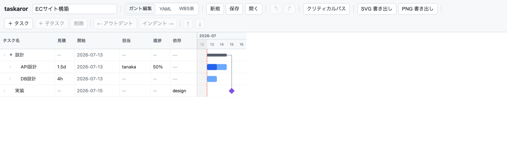
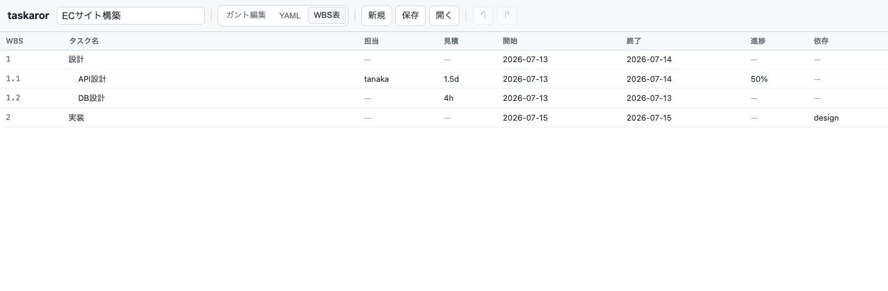
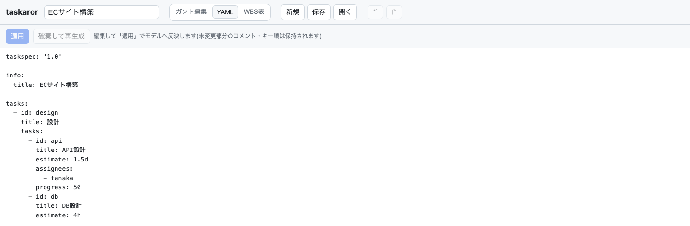

# taskaror

**taskaror** は、YAML ベースのタスク定義フォーマット **TaskSpec** を編集・検証・可視化するためのオープンソースプロジェクトです。ブラウザ上で動くガントチャートエディタを備え、GUI で編集した内容をリアルタイムにガントへ反映し、`.taskspec.yaml` として保存できます。あわせて、検証・lint・SVG 出力を行う CLI を提供します。

TaskSpec は、人・AI・Git が扱いやすいことを重視した、軽量な WBS（Work Breakdown Structure）・ガントチャート向けデータフォーマットです。taskaror はそのリファレンス実装およびツール群を提供します。



## コンセプト

従来の WBS・ガントチャートツールは高機能な一方、独自フォーマットで管理されるため、Git での差分レビューや AI による編集・生成が難しく、Markdown やテキストエディタとの相性も良くありません。taskaror は次のコンセプトでこれらの課題を解決することを目指します。

- **Human First** — 人が直接読み書きできることを最優先に設計
- **AI First** — LLM による WBS 作成・タスク分解・見積り支援・レビューを前提とした構造
- **Git First** — 差分が分かりやすく、Pull Request でのレビュー・マージがしやすい
- **YAML Native** — 親子関係を ID ではなく YAML のネスト構造で自然に表現
- **Single Source of Truth** — 保存するのは人の入力のみ。WBS 番号・終了日・クリティカルパス等はレンダラーが計算し、二重管理を防ぐ
- **Small Core** — コア仕様は最小限に保ち、必要に応じて拡張できる設計

## 主な機能

- **ガントチャートエディタ** — 左は編集可能なタスクグリッド、右は自前の SVG ガント。左右は行が揃い、境界をドラッグしてペイン幅を変更できます
- **スケジュール自動導出** — 見積工数（`1.5d` / `4h`、1d = 8h）・依存・営業日（土日スキップ）から開始日・終了日を計算します（規則は [docs/derivation.md](docs/derivation.md)）。導出値は保存しません
- **直感的な編集** — インライン編集・ダブルクリックの編集ダイアログ・ドラッグ&ドロップでの階層移動・ガントバーのドラッグでの日程調整・依存線のドラッグ設定
- **ビュー切り替え** — ガントチャート / YAML テキスト / WBS 番号付きテーブル
- **YAML の忠実性** — 読み込んだ YAML の未変更部分について、コメント・キー順・引用符スタイルを保持します
- **検証と lint** — JSON Schema + 構造の検証、スケジュール導出から見た矛盾の検出（CLI）
- **キーボード操作 / アクセシビリティ** — 主要操作のショートカット、メニュー・ガントバーのキーボード操作に対応
- **その他** — クリティカルパスの強調、完了タスクの非表示、SVG / PNG エクスポート、localStorage への自動保存

## スクリーンショット

WBS 番号付きテーブルビュー。WBS 番号・開始日・終了日などの導出値を一覧できます。



YAML テキストビュー。YAML を直接編集し「適用」でモデルへ反映できます。



## 使ってみる

GUI エディタは `taskaror serve` で起動します（npx 実行には Node.js 20 以上が必要です）。

```bash
# npx 経由
npx taskaror serve                # http://127.0.0.1:5173 で GUI エディタを配信
npx taskaror serve --port 8080    # ポートを変更(--host で bind 先も変更可)

# Docker 経由(taskaror が entrypoint のイメージ)
docker build --target cli -t taskaror .
docker run --rm -p 5173:5173 taskaror serve
```

リポジトリから直接使う場合は、ルートで `npm install && npm run build` した後に `npm exec taskaror -- serve` を実行します。

## GUI エディタの使い方

### ファイルの作成・読み込み・保存

- **新規作成** — メニューの [ファイル] → [新規]
- **読み込み** — [ファイル] → [開く…] でファイルを選択するか、`.taskspec.yaml` をウィンドウへドラッグ&ドロップします。パース・検証エラーは画面に表示されます
- **保存** — [ファイル] → [保存] で `.taskspec.yaml` としてダウンロードします（ファイル名は `info.title` から導出）
- 編集内容は localStorage に自動保存されるため、リロードしても作業は消えません

### タスクの追加・編集

- **追加** — ツールバーの [タスク追加]（または Insert キー）。スプレッドシート風に、グリッド下部の空行をクリック・空行で入力しても新規タスクを作成できます（行が足りなければ最下端の「○行 追加」で増やせます）
- **インライン編集** — グリッドのセルをクリックして直接編集します（Enter で確定、Tab で隣のセルへ、Esc で取消）
- **詳細編集** — タスクをダブルクリックすると、全フィールド（title / estimate / start / 担当 / 依存 / 進捗 / タグ / メモ）を編集できるダイアログが開きます
- **削除** — [タスク削除]（または Delete キー）。[編集] メニューの [元に戻す] / [やり直し] でいつでも取り消せます

### 階層と並び替え

- ツールバーまたは [編集] メニューの [インデント] / [アウトデント] で階層を、[タスク移動↑] / [タスク移動↓] で並び順を変更します
- グリッドの行をドラッグ&ドロップしても階層・位置を移動できます
- 親タスク（子を持つタスク）はサマリーバーとして描画され、期間は子の包絡から自動計算されます

### スケジュールと依存関係（ガント上の操作）

- **開始日の変更** — ガントバー本体を左右にドラッグします（`start` に反映）
- **見積の変更** — バーの右端をドラッグして伸縮します（`estimate` に反映）
- **依存の追加** — バー端の接続ハンドルから対象のバーへドラッグします（右端から=後続を設定、左端から=先行を設定）。自分自身・子孫・祖先・循環になる向きは設定できません
- **依存の削除** — 依存線をクリックして選択し、Delete キーで削除します
- 見積のない子なしタスクは 0d のマイルストーン（ひし形）として描画されます

### 表示の切り替えとエクスポート

- [表示] メニューで **ガントチャート / YAML / WBS表** を切り替えます。YAML ビューでは直接編集して「適用」でモデルへ反映できます
- [表示] → [クリティカルパスを強調] / [完了タスクを非表示]（進捗 100% を完了とみなすビューのフィルタ）
- [ファイル] → [エクスポート(SVG)] / [エクスポート(PNG)] でガントチャートを画像として書き出します

### キーボードショートカット

| 操作                               | キー                                           |
| ---------------------------------- | ---------------------------------------------- |
| タスク追加 / 削除                  | Insert / Delete                                |
| タスク移動 ↑ / ↓                   | Ctrl+↑ / Ctrl+↓                                |
| インデント / アウトデント          | Ctrl+→ / Ctrl+←                                |
| 元に戻す / やり直し                | Cmd/Ctrl+Z / Cmd/Ctrl+Shift+Z（Ctrl+Y でも可） |
| 行フォーカスの移動                 | ↑ / ↓                                          |
| セル編集の確定 / 隣のセルへ / 取消 | Enter / Tab / Esc                              |

ガントバーは Tab でフォーカスして矢印キーでも操作できます。各ショートカットはメニュー項目にも併記されています。

## CLI

`taskaror` コマンドは `serve` のほかに、spec ファイルを引数に取るサブコマンドを提供します。

```bash
npx taskaror --help               # 使い方を表示(各サブコマンドは <command> --help)
npx taskaror validate task.taskspec.yaml    # JSON Schema+構造の検証(複数ファイル可)
npx taskaror lint task.taskspec.yaml        # スケジュール導出から見た矛盾・怪しい記述を検出
npx taskaror svg task.taskspec.yaml                 # ガントチャート SVG を標準出力へ
npx taskaror svg task.taskspec.yaml -o gantt.svg    # ファイルへ書き出し(--output でも可)

# Docker では、カレントディレクトリを /work にマウントして渡す
docker run --rm -v $PWD:/work taskaror validate task.taskspec.yaml
docker run --rm -v $PWD:/work taskaror lint task.taskspec.yaml
docker run --rm -v $PWD:/work taskaror svg task.taskspec.yaml -o gantt.svg
```

`validate` / `lint` は問題を検出すると終了コード 1 を返すため、CI にも組み込めます。lint のルールは [docs/lint.md](docs/lint.md) を参照してください。

## TaskSpec

TaskSpec は taskaror が採用する YAML ベースの仕様です。JSON Schema は [schema/1.0/taskspec.schema.json](schema/1.0/taskspec.schema.json) にあります。

```yaml
taskspec: '1.0'

info:
  title: ECサイト構築

tasks:
  - id: design
    title: 設計
    tasks:
      - id: api
        title: API設計
        estimate: 1.5d
      - id: db
        title: DB設計
        estimate: 4h

  - id: implementation
    title: 実装
    depends:
      - design
```

保持する情報は、タスク階層・タスク名・見積工数・依存関係・担当者・進捗・タグ・メモのみ。開始日・終了日・WBS 番号などはレンダラーが導出します（規則は [docs/derivation.md](docs/derivation.md)）。サンプルは [examples/](examples/) にあります。

### 拡張性

`x-` プレフィックスによる独自拡張をサポートします。標準仕様との互換性を保ったまま、組織固有の情報を追加できます。

```yaml
tasks:
  - id: api
    title: API設計
    x-ticket: DEV-123
    x-reviewer: tanaka
```

### 対象外（Non-Goals）

リソース管理・勤務カレンダー・コスト管理・EVM・ポートフォリオ管理・スケジューリングアルゴリズム・UI の挙動は仕様の対象外とし、各実装や周辺ツールの責務とします。

## ドキュメント

- [docs/derivation.md](docs/derivation.md) — スケジュール導出ルール（開始日・終了日・親タスクの計算規則）
- [docs/lint.md](docs/lint.md) — `taskaror lint` のルール仕様
- [docs/decisions.md](docs/decisions.md) — 設計方針・決定記録
- [docs/development.md](docs/development.md) — 開発ガイド（セットアップ・コマンド・アーキテクチャ）

## 開発

npm workspaces のモノレポ構成（共有コア `packages/core` / GUI `packages/web` / CLI `packages/cli`）です。開発環境のセットアップ・コマンド・アーキテクチャの詳細は [docs/development.md](docs/development.md) を参照してください。

## ロードマップ

提供済み:

- TaskSpec JSON Schema / バリデーター（`taskaror validate`）/ Linter（`taskaror lint`）
- CLI（npx / Docker で実行する `taskaror` コマンド）
- WBS・ガントチャートレンダラー（GUI と `taskaror svg` の SVG 出力）

今後の予定:

- Formatter
- Markdown（Remark）プラグイン
- VS Code 拡張 / Language Server Protocol (LSP)
- エクスポート（HTML / Excel / CSV / Mermaid）

## TaskSpec と taskaror の関係

TaskSpec は仕様であり、taskaror はその仕様を実装した OSS のひとつです。将来的には他言語・他プラットフォームによる実装が生まれることを歓迎します。

## ライセンス

Apache License 2.0 のもとで公開しています。詳細はリポジトリ同梱の [LICENSE](LICENSE) を参照してください。
