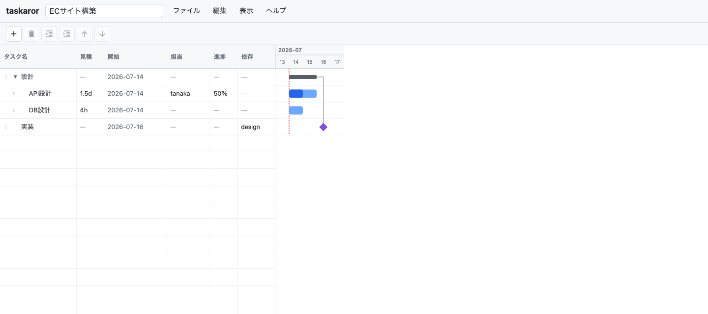
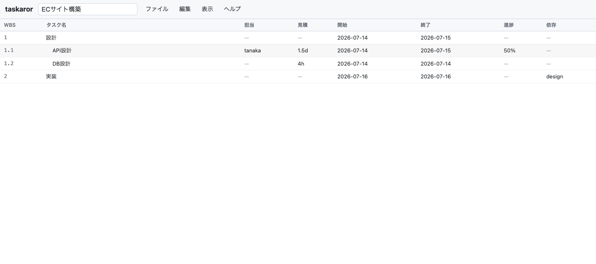
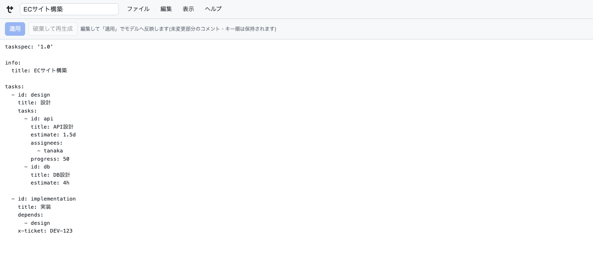

# taskaror

**taskaror** は、YAML ベースのタスク定義フォーマット **TaskSpec** を編集・検証・可視化するためのオープンソースプロジェクトです。ブラウザ上で動くガントチャートエディタを備え、GUI で編集した内容をリアルタイムにガントへ反映し、`.taskspec.yaml` として保存できます。あわせて、検証・lint・SVG / PNG / PDF 出力を行う CLI を提供します。

TaskSpec は、人・AI・Git が扱いやすいことを重視した、軽量な WBS（Work Breakdown Structure）・ガントチャート向けデータフォーマットです。taskaror はそのリファレンス実装およびツール群を提供します。

📖 **ドキュメントサイト: <https://yosiopp.github.io/taskaror/>**（TaskSpec の仕様・操作方法・ヘルプ）



## コンセプト

従来の WBS・ガントチャートツールは高機能な一方、独自フォーマットで管理されるため、Git での差分レビューや AI による編集・生成が難しく、Markdown やテキストエディタとの相性も良くありません。taskaror は次のコンセプトでこれらの課題を解決することを目指します。

- **Human First** — 人が直接読み書きできることを最優先に設計
- **AI First** — LLM による WBS 作成・タスク分解・見積り支援・レビューを前提とした構造
- **Git First** — 差分が分かりやすく、Pull Request でのレビュー・マージがしやすい
- **YAML Native** — 親子関係を ID ではなく YAML のネスト構造で自然に表現
- **Single Source of Truth** — 保存するのは人の入力のみ。WBS 番号・終了日・クリティカルパス等はレンダラーが計算し、二重管理を防ぐ
- **Small Core** — コア仕様は最小限に保ち、必要に応じて拡張できる設計

## 主な機能

- **ガントチャートエディタ** — 左は編集可能なタスクグリッド、右は自前の SVG ガント。左右は行が揃い、境界をドラッグしてペイン幅を変更できます
- **スケジュール自動導出** — 見積工数（`1.5d` / `4h`、1d = 8h）・依存・営業日（土日スキップ）から開始日・終了日を計算します（[導出ルール](https://yosiopp.github.io/taskaror/derivation)）。導出値は保存しません
- **直感的な編集** — インライン編集・ダブルクリックの編集ダイアログ・ドラッグ&ドロップでの階層移動・ガントバーのドラッグでの日程調整・依存線のドラッグ設定
- **ビュー切り替え** — ガントチャート / YAML テキスト / WBS 番号付きテーブル
- **YAML の忠実性** — 読み込んだ YAML の未変更部分について、コメント・キー順・引用符スタイルを保持します
- **検証と lint** — JSON Schema + 構造の検証、スケジュール導出から見た矛盾の検出（CLI）
- **キーボード操作 / アクセシビリティ** — 主要操作のショートカット、メニュー・ガントバーのキーボード操作に対応
- **その他** — クリティカルパスの強調、完了タスクの非表示、SVG / PNG エクスポート、localStorage への自動保存

## スクリーンショット

WBS 番号付きテーブルビュー。WBS 番号・開始日・終了日などの導出値を一覧できます。



YAML テキストビュー。YAML を直接編集し「適用」でモデルへ反映できます。



## 使ってみる

GUI エディタは `taskaror serve` で起動します（npx 実行には Node.js 20 以上が必要です）。

```bash
# npx 経由
npx taskaror serve                # http://127.0.0.1:5173 で GUI エディタを配信
npx taskaror serve --port 8080    # ポートを変更(--host で bind 先も変更可)

# Docker 経由(GHCR で公開している、taskaror が entrypoint のイメージ)
docker pull ghcr.io/yosiopp/taskaror
docker run --rm -p 5173:5173 ghcr.io/yosiopp/taskaror serve
```

リポジトリから直接使う場合は、ルートで `npm install && npm run build` した後に `npm exec taskaror -- serve` を実行します。

エディタの操作方法は **[GUI エディタの使い方](https://yosiopp.github.io/taskaror/gui)** を参照してください。

## CLI

`taskaror` コマンドは `serve` のほかに、spec ファイルを引数に取るサブコマンドを提供します（詳細は [CLI の使い方](https://yosiopp.github.io/taskaror/cli)）。

```bash
npx taskaror --help               # 使い方を表示(各サブコマンドは <command> --help)
npx taskaror validate task.taskspec.yaml    # JSON Schema+構造の検証(複数ファイル可)
npx taskaror lint task.taskspec.yaml        # スケジュール導出から見た矛盾・怪しい記述を検出
npx taskaror svg task.taskspec.yaml                 # ガントチャート SVG を標準出力へ
npx taskaror svg task.taskspec.yaml -o gantt.svg    # ファイルへ書き出し(--output でも可)
npx taskaror png task.taskspec.yaml -o gantt.png    # PNG 出力(要 Chrome / Chromium / Edge)
npx taskaror pdf task.taskspec.yaml -o gantt.pdf    # PDF 出力(要 Chrome / Chromium / Edge)

# Docker では、カレントディレクトリを /work にマウントして渡す
docker run --rm -v $PWD:/work ghcr.io/yosiopp/taskaror validate task.taskspec.yaml
```

`validate` / `lint` は問題を検出すると終了コード 1 を返すため、CI にも組み込めます（[lint ルール](https://yosiopp.github.io/taskaror/lint)）。

## ドキュメント

利用者向けドキュメントは GitHub Pages で公開しています（ソースは [docs/site/](docs/site/)）。

- [TaskSpec フォーマット](https://yosiopp.github.io/taskaror/taskspec) — YAML フォーマットの仕様（フィールド一覧・拡張性・Non-Goals）
- [GUI エディタの使い方](https://yosiopp.github.io/taskaror/gui) — 操作方法・キーボードショートカット
- [CLI の使い方](https://yosiopp.github.io/taskaror/cli) — `taskaror` コマンドのリファレンス
- [スケジュール導出ルール](https://yosiopp.github.io/taskaror/derivation) — 開始日・終了日・期間の計算規則
- [lint ルール](https://yosiopp.github.io/taskaror/lint) — `taskaror lint` のルール仕様

開発者向けドキュメントはリポジトリ内にあります。

- [docs/development.md](docs/development.md) — 開発ガイド（セットアップ・コマンド・アーキテクチャ）
- [docs/decisions.md](docs/decisions.md) — 設計方針・決定記録

## 開発

npm workspaces のモノレポ構成（共有コア `packages/core` / GUI `packages/web` / CLI `packages/cli`）です。開発環境のセットアップ・コマンド・アーキテクチャの詳細は [docs/development.md](docs/development.md) を参照してください。

## ロードマップ

提供済み:

- TaskSpec JSON Schema / バリデーター（`taskaror validate`）/ Linter（`taskaror lint`）
- CLI（npx / Docker で実行する `taskaror` コマンド）
- WBS・ガントチャートレンダラー（GUI と `taskaror svg` の SVG 出力）

今後の予定:

- Formatter
- Markdown（Remark）プラグイン
- VS Code 拡張 / Language Server Protocol (LSP)
- エクスポート（HTML / Excel / CSV / Mermaid）

## TaskSpec と taskaror の関係

TaskSpec は仕様であり、taskaror はその仕様を実装した OSS のひとつです。将来的には他言語・他プラットフォームによる実装が生まれることを歓迎します。

## ライセンス

Apache License 2.0 のもとで公開しています。詳細はリポジトリ同梱の [LICENSE](LICENSE) を参照してください。
